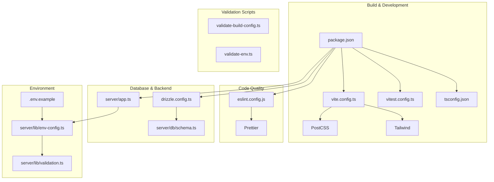
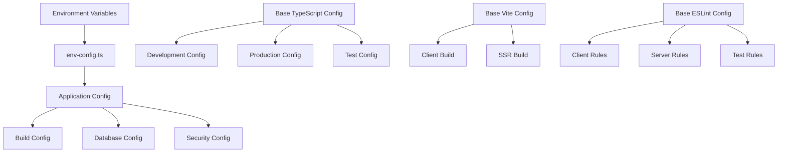
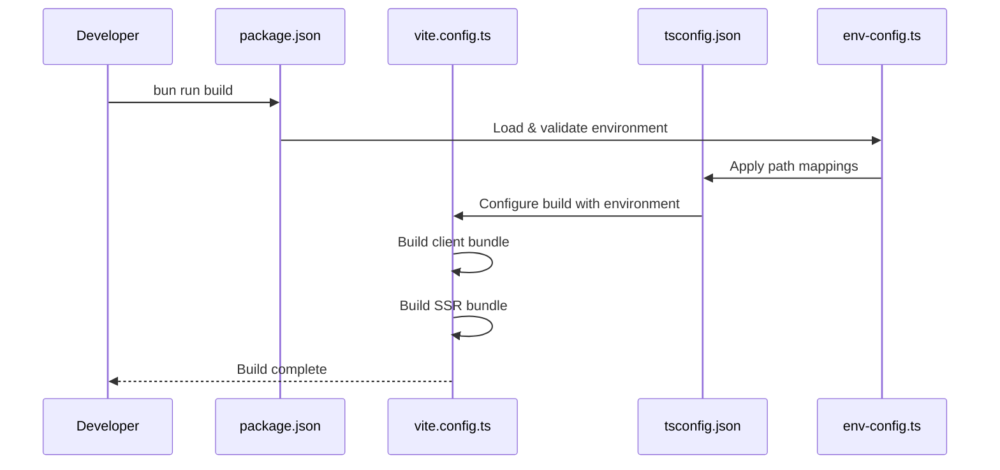
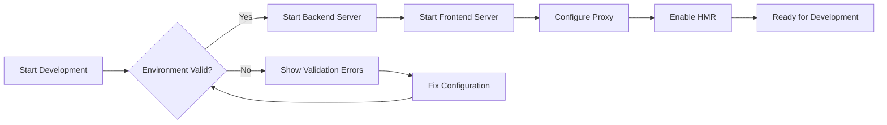
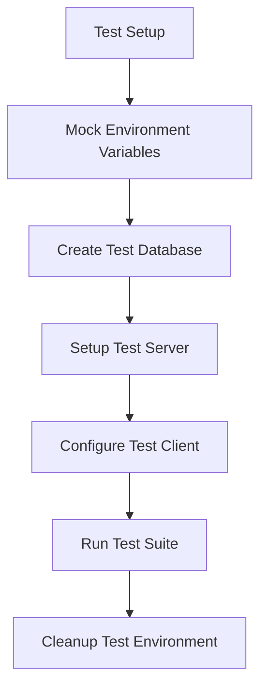
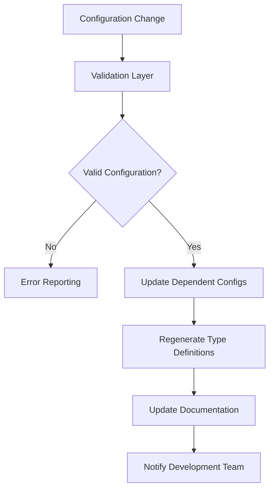
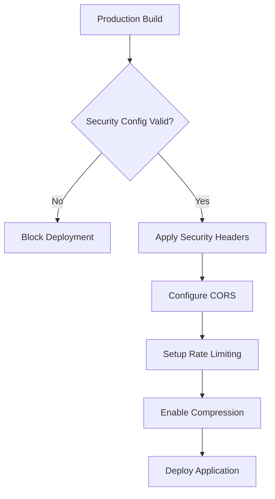

# Configuration Integration Overhaul

## Overview

This design documents a comprehensive overhaul of the HackerFolio-Tulio project
configuration to eliminate mismatches, conflicts, and ensure seamless
integration between frontend and backend. The goal is to create a tight,
well-orchestrated configuration ecosystem that supports development, building,
testing, and production deployment without friction.

## Architecture

### Current Configuration Landscape

The project currently uses multiple configuration files across different
domains:



### Configuration Integration Points

#### 1. Path Resolution Alignment

- TypeScript path mapping in `tsconfig.json`
- Vite alias configuration in `vite.config.ts`
- Vitest alias configuration in `vitest.config.ts`
- ESLint import resolver configuration

#### 2. Build Output Consistency

- Vite build outputs to `dist/public` and `dist/server`
- Server static file serving from `dist/public`
- SSR bundle import from `dist/server/entry-server.js`

#### 3. Development Server Coordination

- Vite dev server on default port with proxy to backend
- Elysia backend server on port 3001
- Environment validation ensuring port alignment

## Component Architecture

### Unified Configuration Strategy

#### Configuration Hierarchy



#### Configuration Consolidation Model

1. **Central Configuration Registry**
   - Single source of truth for all configuration values
   - Environment-aware configuration resolution
   - Type-safe configuration access across all modules

2. **Modular Configuration System**
   - Separate configuration modules for different concerns
   - Inheritance-based configuration for environment-specific overrides
   - Validation layer ensuring configuration consistency

3. **Cross-Configuration Validation**
   - Build-time validation of configuration alignment
   - Runtime validation of environment-dependent settings
   - Development-time warnings for configuration mismatches

### Enhanced Environment Configuration

#### Comprehensive Environment Schema

```typescript
interface ConfigSchema {
  // Application Core
  app: {
    name: string
    version: string
    environment: 'development' | 'production' | 'test'
    port: number
    baseUrl: string
  }

  // Build Configuration
  build: {
    clientOutDir: string
    serverOutDir: string
    staticDir: string
    assetsDir: string
    sourcemap: boolean
    minify: boolean
  }

  // Development Configuration
  development: {
    hmr: boolean
    proxyPort: number
    watchPaths: string[]
    mockApis: boolean
  }

  // Database Configuration
  database: {
    url: string
    dialect: 'sqlite' | 'postgresql' | 'mysql'
    migrations: {
      directory: string
      tableName: string
    }
    pool: {
      min: number
      max: number
    }
  }

  // Security Configuration
  security: {
    corsOrigins: string[]
    sessionSecret: string
    rateLimiting: {
      requests: number
      windowMs: number
    }
    headers: {
      csp: string
      hsts: boolean
    }
  }

  // Feature Flags
  features: {
    githubIntegration: boolean
    terminalLogging: boolean
    analytics: boolean
    ssr: boolean
  }

  // External Services
  external: {
    github: {
      token?: string
      timeout: number
      cacheDuration: number
    }
    sentry?: {
      dsn: string
      environment: string
    }
  }
}
```

### Build System Integration

#### Unified Build Configuration



#### Build Process Orchestration

1. **Pre-build Validation**
   - Environment variable validation
   - Configuration consistency checks
   - Dependency compatibility verification
   - Path resolution validation

2. **Build Execution**
   - Client bundle generation with environment-specific optimizations
   - SSR bundle generation with server-side optimizations
   - Asset optimization and compression
   - Source map generation based on environment

3. **Post-build Verification**
   - Bundle size analysis
   - Output directory structure validation
   - Asset integrity verification
   - SSR compatibility testing

### Development Workflow Integration

#### Seamless Development Experience



#### Development Server Coordination

1. **Backend Server Initialization**
   - Environment validation and loading
   - Database migration application
   - Security middleware configuration
   - API route registration

2. **Frontend Server Setup**
   - Vite development server with HMR
   - Proxy configuration for API routes
   - Static asset serving
   - Component hot reload

3. **Cross-Server Communication**
   - Consistent port configuration
   - Shared type definitions
   - API contract validation
   - Development-specific optimizations

## Testing Strategy

### Configuration Testing Framework

#### Test Environment Setup



#### Configuration Validation Tests

1. **Environment Configuration Tests**
   - Valid environment variable combinations
   - Invalid configuration error handling
   - Environment-specific configuration loading
   - Feature flag validation

2. **Build Configuration Tests**
   - Build output directory structure
   - Asset generation and optimization
   - SSR bundle functionality
   - Source map generation

3. **Development Configuration Tests**
   - Development server startup
   - HMR functionality
   - Proxy configuration
   - Path resolution accuracy

4. **Integration Configuration Tests**
   - End-to-end build process
   - Database migration execution
   - API endpoint availability
   - Frontend-backend communication

### Configuration Validation Matrix

| Configuration Area    | Development         | Production            | Test              |
| --------------------- | ------------------- | --------------------- | ----------------- |
| Environment Variables | Optional + Defaults | Required + Validation | Mocked + Isolated |
| Database Setup        | File-based SQLite   | Persistent Database   | In-memory SQLite  |
| Security Headers      | Relaxed             | Strict                | Disabled          |
| Source Maps           | Enabled             | Conditional           | Enabled           |
| Asset Optimization    | Minimal             | Full                  | None              |
| Logging Level         | Debug               | Info/Warn             | Silent            |
| HMR                   | Enabled             | Disabled              | Disabled          |
| API Mocking           | Optional            | Disabled              | Enabled           |

## Configuration Management Patterns

### Environment-Aware Configuration Loading

```typescript
class ConfigurationManager {
  private static instance: ConfigurationManager
  private config: ConfigSchema

  constructor() {
    this.config = this.loadConfiguration()
  }

  private loadConfiguration(): ConfigSchema {
    const environment = process.env.NODE_ENV || 'development'
    const baseConfig = this.loadBaseConfig()
    const envConfig = this.loadEnvironmentConfig(environment)

    return this.mergeConfigurations(baseConfig, envConfig)
  }

  public get<T extends keyof ConfigSchema>(section: T): ConfigSchema[T] {
    return this.config[section]
  }

  public validate(): ValidationResult {
    return this.validateConfiguration(this.config)
  }
}
```

### Configuration Inheritance Strategy

1. **Base Configuration**
   - Default values for all environments
   - Common configuration shared across environments
   - Type definitions and schemas

2. **Environment-Specific Overrides**
   - Development-specific optimizations
   - Production security and performance settings
   - Test environment isolation settings

3. **Local Configuration Overrides**
   - Developer-specific customizations
   - Local database connection strings
   - Debug and development flags

### Cross-Configuration Synchronization

#### Automated Configuration Alignment



#### Configuration Drift Prevention

1. **Configuration Linting**
   - Automated checks for configuration consistency
   - Validation of cross-file references
   - Detection of unused configuration values

2. **Configuration Documentation**
   - Automatic generation of configuration documentation
   - Schema-driven documentation updates
   - Examples and best practices

3. **Configuration Testing**
   - Unit tests for configuration loading
   - Integration tests for configuration application
   - End-to-end tests for configuration effects

## Deployment Configuration

### Production Configuration Hardening

#### Security Configuration Enforcement



#### Production Readiness Checklist

1. **Security Requirements**
   - Session secret configuration
   - CORS origins specification
   - Content Security Policy setup
   - Rate limiting configuration

2. **Performance Optimization**
   - Asset compression and minification
   - Cache header configuration
   - CDN integration setup
   - Database connection pooling

3. **Monitoring and Logging**
   - Structured logging configuration
   - Error tracking integration
   - Performance monitoring setup
   - Health check endpoint configuration

### Environment-Specific Deployment

#### Deployment Configuration Matrix

| Environment | Database        | Static Assets | SSR      | Monitoring |
| ----------- | --------------- | ------------- | -------- | ---------- |
| Development | Local SQLite    | Local Files   | Optional | Console    |
| Staging     | Hosted Database | CDN           | Enabled  | Basic      |
| Production  | Hosted Database | CDN           | Enabled  | Full       |

#### Configuration Deployment Pipeline

1. **Configuration Validation**
   - Environment-specific validation
   - Security requirement verification
   - Performance setting optimization

2. **Build Configuration Application**
   - Environment-specific build settings
   - Asset optimization configuration
   - Bundle splitting configuration

3. **Runtime Configuration Injection**
   - Environment variable injection
   - Secret management integration
   - Feature flag configuration

## Migration Strategy

### Configuration Migration Path

#### Phase 1: Consolidation

- Centralize environment configuration
- Standardize path resolution across tools
- Unify build output destinations

#### Phase 2: Validation Enhancement

- Implement comprehensive configuration validation
- Add cross-configuration consistency checks
- Create configuration testing framework

#### Phase 3: Automation

- Automate configuration synchronization
- Implement configuration drift detection
- Add automated documentation generation

#### Phase 4: Optimization

- Optimize build performance with better configuration
- Implement advanced caching strategies
- Add production-specific optimizations

### Risk Mitigation

#### Configuration Change Impact Assessment


#### Rollback Strategy

1. **Configuration Versioning**
   - Version-controlled configuration files
   - Tagged configuration releases
   - Configuration change history tracking

2. **Incremental Migration**
   - Gradual configuration consolidation
   - Feature flag-controlled rollout
   - A/B testing for configuration changes

3. **Monitoring and Alerting**
   - Configuration health monitoring
   - Performance impact tracking
   - Error rate monitoring during migrations


### Configuration Integration Points

#### 1. Path Resolution Alignment

- TypeScript path mapping in `tsconfig.json`
- Vite alias configuration in `vite.config.ts`
- Vitest alias configuration in `vitest.config.ts`
- ESLint import resolver configuration

#### 2. Build Output Consistency

- Vite build outputs to `dist/public` and `dist/server`
- Server static file serving from `dist/public`
- SSR bundle import from `dist/server/entry-server.js`

#### 3. Development Server Coordination

- Vite dev server on default port with proxy to backend
- Elysia backend server on port 3001
- Environment validation ensuring port alignment

## Component Architecture

### Unified Configuration Strategy

#### Configuration Hierarchy


#### Configuration Consolidation Model

1. **Central Configuration Registry**
   - Single source of truth for all configuration values
   - Environment-aware configuration resolution
   - Type-safe configuration access across all modules

2. **Modular Configuration System**
   - Separate configuration modules for different concerns
   - Inheritance-based configuration for environment-specific overrides
   - Validation layer ensuring configuration consistency

3. **Cross-Configuration Validation**
   - Build-time validation of configuration alignment
   - Runtime validation of environment-dependent settings
   - Development-time warnings for configuration mismatches

### Enhanced Environment Configuration

#### Comprehensive Environment Schema

```typescript
interface ConfigSchema {
  // Application Core
  app: {
    name: string
    version: string
    environment: 'development' | 'production' | 'test'
    port: number
    baseUrl: string
  }

  // Build Configuration
  build: {
    clientOutDir: string
    serverOutDir: string
    staticDir: string
    assetsDir: string
    sourcemap: boolean
    minify: boolean
  }

  // Development Configuration
  development: {
    hmr: boolean
    proxyPort: number
    watchPaths: string[]
    mockApis: boolean
  }

  // Database Configuration
  database: {
    url: string
    dialect: 'sqlite' | 'postgresql' | 'mysql'
    migrations: {
      directory: string
      tableName: string
    }
    pool: {
      min: number
      max: number
    }
  }

  // Security Configuration
  security: {
    corsOrigins: string[]
    sessionSecret: string
    rateLimiting: {
      requests: number
      windowMs: number
    }
    headers: {
      csp: string
      hsts: boolean
    }
  }

  // Feature Flags
  features: {
    githubIntegration: boolean
    terminalLogging: boolean
    analytics: boolean
    ssr: boolean
  }

  // External Services
  external: {
    github: {
      token?: string
      timeout: number
      cacheDuration: number
    }
    sentry?: {
      dsn: string
      environment: string
    }
  }
}
```

### Build System Integration

#### Unified Build Configuration


#### Build Process Orchestration

1. **Pre-build Validation**
   - Environment variable validation
   - Configuration consistency checks
   - Dependency compatibility verification
   - Path resolution validation

2. **Build Execution**
   - Client bundle generation with environment-specific optimizations
   - SSR bundle generation with server-side optimizations
   - Asset optimization and compression
   - Source map generation based on environment

3. **Post-build Verification**
   - Bundle size analysis
   - Output directory structure validation
   - Asset integrity verification
   - SSR compatibility testing

### Development Workflow Integration

#### Seamless Development Experience


#### Development Server Coordination

1. **Backend Server Initialization**
   - Environment validation and loading
   - Database migration application
   - Security middleware configuration
   - API route registration

2. **Frontend Server Setup**
   - Vite development server with HMR
   - Proxy configuration for API routes
   - Static asset serving
   - Component hot reload

3. **Cross-Server Communication**
   - Consistent port configuration
   - Shared type definitions
   - API contract validation
   - Development-specific optimizations

## Testing Strategy

### Configuration Testing Framework

#### Test Environment Setup


#### Configuration Validation Tests

1. **Environment Configuration Tests**
   - Valid environment variable combinations
   - Invalid configuration error handling
   - Environment-specific configuration loading
   - Feature flag validation

2. **Build Configuration Tests**
   - Build output directory structure
   - Asset generation and optimization
   - SSR bundle functionality
   - Source map generation

3. **Development Configuration Tests**
   - Development server startup
   - HMR functionality
   - Proxy configuration
   - Path resolution accuracy

4. **Integration Configuration Tests**
   - End-to-end build process
   - Database migration execution
   - API endpoint availability
   - Frontend-backend communication

### Configuration Validation Matrix

| Configuration Area    | Development         | Production            | Test              |
| --------------------- | ------------------- | --------------------- | ----------------- |
| Environment Variables | Optional + Defaults | Required + Validation | Mocked + Isolated |
| Database Setup        | File-based SQLite   | Persistent Database   | In-memory SQLite  |
| Security Headers      | Relaxed             | Strict                | Disabled          |
| Source Maps           | Enabled             | Conditional           | Enabled           |
| Asset Optimization    | Minimal             | Full                  | None              |
| Logging Level         | Debug               | Info/Warn             | Silent            |
| HMR                   | Enabled             | Disabled              | Disabled          |
| API Mocking           | Optional            | Disabled              | Enabled           |

## Configuration Management Patterns

### Environment-Aware Configuration Loading

```typescript
class ConfigurationManager {
  private static instance: ConfigurationManager
  private config: ConfigSchema

  constructor() {
    this.config = this.loadConfiguration()
  }

  private loadConfiguration(): ConfigSchema {
    const environment = process.env.NODE_ENV || 'development'
    const baseConfig = this.loadBaseConfig()
    const envConfig = this.loadEnvironmentConfig(environment)

    return this.mergeConfigurations(baseConfig, envConfig)
  }

  public get<T extends keyof ConfigSchema>(section: T): ConfigSchema[T] {
    return this.config[section]
  }

  public validate(): ValidationResult {
    return this.validateConfiguration(this.config)
  }
}
```

### Configuration Inheritance Strategy

1. **Base Configuration**
   - Default values for all environments
   - Common configuration shared across environments
   - Type definitions and schemas

2. **Environment-Specific Overrides**
   - Development-specific optimizations
   - Production security and performance settings
   - Test environment isolation settings

3. **Local Configuration Overrides**
   - Developer-specific customizations
   - Local database connection strings
   - Debug and development flags

### Cross-Configuration Synchronization

#### Automated Configuration Alignment


#### Configuration Drift Prevention

1. **Configuration Linting**
   - Automated checks for configuration consistency
   - Validation of cross-file references
   - Detection of unused configuration values

2. **Configuration Documentation**
   - Automatic generation of configuration documentation
   - Schema-driven documentation updates
   - Examples and best practices

3. **Configuration Testing**
   - Unit tests for configuration loading
   - Integration tests for configuration application
   - End-to-end tests for configuration effects

## Deployment Configuration

### Production Configuration Hardening

#### Security Configuration Enforcement


#### Production Readiness Checklist

1. **Security Requirements**
   - Session secret configuration
   - CORS origins specification
   - Content Security Policy setup
   - Rate limiting configuration

2. **Performance Optimization**
   - Asset compression and minification
   - Cache header configuration
   - CDN integration setup
   - Database connection pooling

3. **Monitoring and Logging**
   - Structured logging configuration
   - Error tracking integration
   - Performance monitoring setup
   - Health check endpoint configuration

### Environment-Specific Deployment

#### Deployment Configuration Matrix

| Environment | Database        | Static Assets | SSR      | Monitoring |
| ----------- | --------------- | ------------- | -------- | ---------- |
| Development | Local SQLite    | Local Files   | Optional | Console    |
| Staging     | Hosted Database | CDN           | Enabled  | Basic      |
| Production  | Hosted Database | CDN           | Enabled  | Full       |

#### Configuration Deployment Pipeline

1. **Configuration Validation**
   - Environment-specific validation
   - Security requirement verification
   - Performance setting optimization

2. **Build Configuration Application**
   - Environment-specific build settings
   - Asset optimization configuration
   - Bundle splitting configuration

3. **Runtime Configuration Injection**
   - Environment variable injection
   - Secret management integration
   - Feature flag configuration

## Migration Strategy

### Configuration Migration Path

#### Phase 1: Consolidation

- Centralize environment configuration
- Standardize path resolution across tools
- Unify build output destinations

#### Phase 2: Validation Enhancement

- Implement comprehensive configuration validation
- Add cross-configuration consistency checks
- Create configuration testing framework

#### Phase 3: Automation

- Automate configuration synchronization
- Implement configuration drift detection
- Add automated documentation generation

#### Phase 4: Optimization

- Optimize build performance with better configuration
- Implement advanced caching strategies
- Add production-specific optimizations

### Risk Mitigation

#### Configuration Change Impact Assessment


#### Rollback Strategy

1. **Configuration Versioning**
   - Version-controlled configuration files
   - Tagged configuration releases
   - Configuration change history tracking

2. **Incremental Migration**
   - Gradual configuration consolidation
   - Feature flag-controlled rollout
   - A/B testing for configuration changes

3. **Monitoring and Alerting**
   - Configuration health monitoring
   - Performance impact tracking
   - Error rate monitoring during migrations
