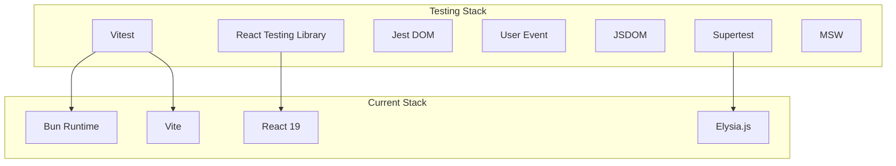
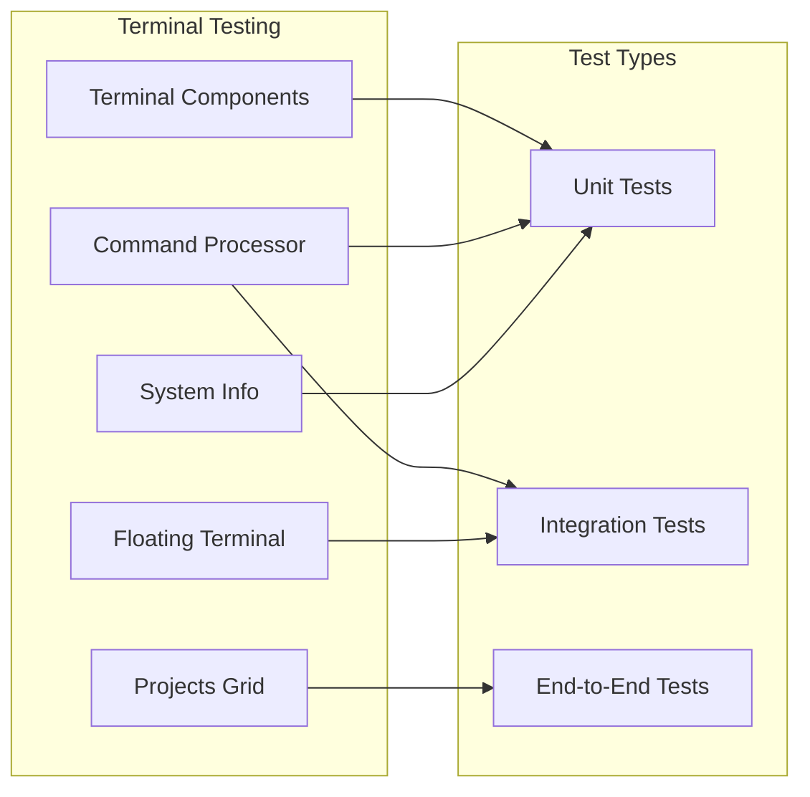
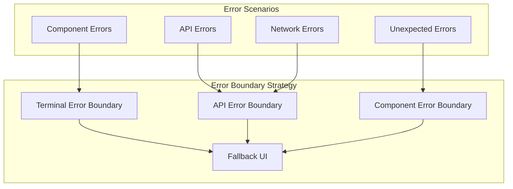
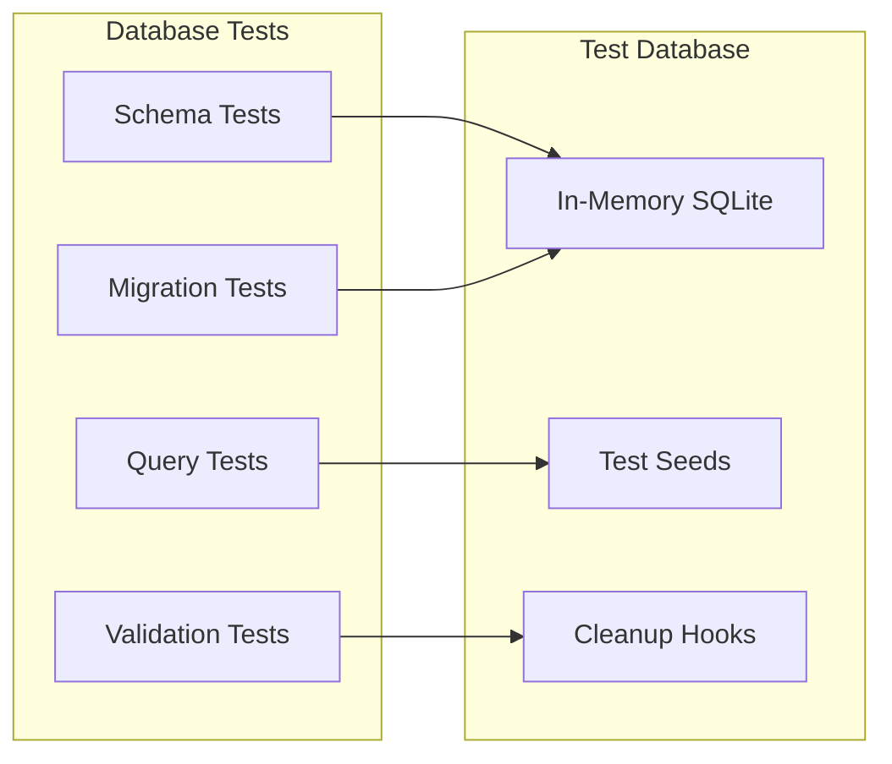
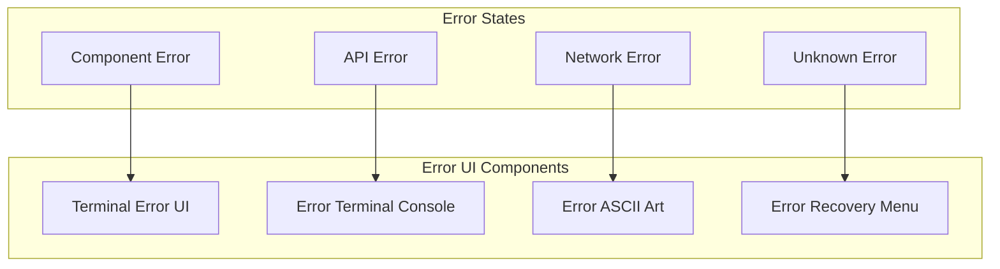
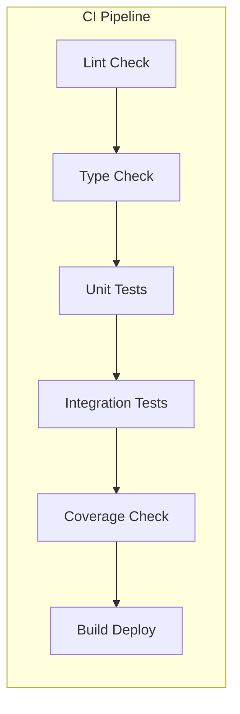

# HackerFolio-Tulio Testing Framework Design

## Overview

This design document outlines the implementation of a comprehensive testing
framework for the HackerFolio-Tulio project to address critical gaps in code
coverage, error handling, and overall robustness. The project currently has zero
test coverage, missing error boundaries, and inconsistent error handling
patterns - all critical issues for a production-ready application.

## Technology Stack & Dependencies

### Current Stack Analysis

- **Runtime**: Bun (v1.0+)
- **Frontend**: React 19 + Vite + TypeScript
- **Backend**: Elysia.js + Drizzle ORM + SQLite
- **Styling**: Tailwind CSS + Cyberpunk Theme
- **Routing**: @tanstack/react-router
- **Validation**: Zod schemas

### Testing Dependencies Required



## Testing Architecture

### Component Testing Strategy

#### Terminal Component Testing



#### Error Boundary Testing Framework



### API Testing Strategy

#### Endpoint Testing Matrix

| Endpoint                | Method | Test Types             | Priority |
| ----------------------- | ------ | ---------------------- | -------- |
| `/api/projects`         | GET    | Unit, Integration, E2E | High     |
| `/api/commands`         | GET    | Unit, Integration      | High     |
| `/api/commands/execute` | POST   | Unit, Integration, E2E | Critical |
| `/api/content/:section` | GET    | Unit, Integration      | Medium   |
| Health Check            | GET    | Unit                   | Low      |

#### Database Testing Strategy



## Implementation Specifications

### Test File Structure

```
project-root/
├── client/
│   ├── src/
│   │   ├── __tests__/
│   │   │   ├── components/
│   │   │   │   ├── terminal/
│   │   │   │   │   ├── command-processor.test.ts
│   │   │   │   │   ├── floating-dock-terminal.test.tsx
│   │   │   │   │   ├── terminal-window.test.tsx
│   │   │   │   │   └── theme-context.test.tsx
│   │   │   │   ├── ui/
│   │   │   │   │   ├── card.test.tsx
│   │   │   │   │   ├── evervault-card.test.tsx
│   │   │   │   │   └── layout-grid.test.tsx
│   │   │   │   └── error-boundary.test.tsx
│   │   │   ├── hooks/
│   │   │   │   └── use-typewriter.test.tsx
│   │   │   ├── lib/
│   │   │   │   ├── api.test.ts
│   │   │   │   └── utils.test.ts
│   │   │   └── pages/
│   │   │       ├── home.test.tsx
│   │   │       ├── projects.test.tsx
│   │   │       └── resume.test.tsx
│   │   ├── __mocks__/
│   │   │   ├── api.ts
│   │   │   └── portfolio-data.ts
│   │   └── test-utils/
│   │       ├── render-with-providers.tsx
│   │       ├── mock-router.tsx
│   │       └── test-constants.ts
├── server/
│   ├── __tests__/
│   │   ├── routes/
│   │   │   ├── api.test.ts
│   │   │   └── terminal.test.ts
│   │   ├── db/
│   │   │   ├── schema.test.ts
│   │   │   └── migrate.test.ts
│   │   ├── lib/
│   │   │   └── validation.test.ts
│   │   └── utils/
│   │       └── terminal.test.ts
│   ├── __mocks__/
│   │   └── database.ts
│   └── test-setup/
│       ├── test-db.ts
│       └── test-server.ts
├── shared/
│   ├── __tests__/
│   │   ├── types.test.ts
│   │   └── utils.test.ts
│   └── __mocks__/
│       └── shared-data.ts
└── test-config/
    ├── vitest.config.ts
    ├── setup-tests.ts
    └── test-environment.ts
```

### Core Testing Components

#### 1. Terminal Command Processor Testing

**Test Coverage Requirements:**

- Command parsing validation
- Command execution flow
- Error handling for invalid commands
- Terminal output formatting
- Command history management

**Test Patterns:**

```typescript
// Example test structure for command processor
describe('CommandProcessor', () => {
  describe('Command Parsing', () => {
    test('parses valid commands correctly')
    test('handles invalid command syntax')
    test('validates command arguments')
  })

  describe('Command Execution', () => {
    test('executes help command')
    test('executes projects command with filters')
    test('handles async command responses')
  })

  describe('Error Handling', () => {
    test('displays user-friendly error messages')
    test('maintains terminal state on errors')
    test('logs errors appropriately')
  })
})
```

#### 2. React Component Testing

**Component Test Requirements:**

- Render validation
- Props handling
- User interaction simulation
- State management verification
- Accessibility compliance

**Error Boundary Test Patterns:**

```typescript
// Error boundary testing structure
describe('TerminalErrorBoundary', () => {
  test('catches and displays terminal-themed errors')
  test('provides fallback UI maintaining cyberpunk aesthetic')
  test('logs error context for debugging')
  test('allows error recovery when possible')
  test('maintains terminal history during errors')
})
```

#### 3. API Integration Testing

**API Test Requirements:**

- Request/response validation
- Error status code handling
- Network failure simulation
- Data transformation verification
- Authentication/authorization

**Database Test Patterns:**

```typescript
// Database testing structure
describe('Database Integration', () => {
  beforeEach(() => {
    // Setup test database
    // Seed test data
  })

  afterEach(() => {
    // Cleanup test data
  })

  test('validates schema constraints')
  test('handles migration scenarios')
  test('maintains data integrity')
})
```

### Error Handling Enhancement

#### Terminal-Themed Error Components

**Error Boundary Implementation:**

- Cyberpunk-styled error messages
- Terminal-compatible error displays
- Graceful degradation strategies
- Error recovery mechanisms
- Context preservation during errors

**Error UI Specifications:**



#### API Error Standardization

**Standardized Error Response Format:**

```typescript
interface StandardErrorResponse {
  error: {
    code: string
    message: string
    details?: Record<string, unknown>
    timestamp: string
    requestId: string
  }
  status: number
}
```

**Error Handling Patterns:**

- Consistent HTTP status codes
- User-friendly error messages
- Detailed error logging
- Retry mechanisms for transient failures
- Graceful degradation for non-critical errors

### Testing Configuration

#### Vitest Configuration

**Test Environment Setup:**

```typescript
// vitest.config.ts structure
export default defineConfig({
  test: {
    environment: 'jsdom',
    setupFiles: ['./test-config/setup-tests.ts'],
    coverage: {
      provider: 'v8',
      reporter: ['text', 'html', 'json'],
      threshold: {
        global: {
          branches: 80,
          functions: 80,
          lines: 80,
          statements: 80,
        },
      },
    },
    globals: true,
    css: true,
  },
})
```

#### Test Database Configuration

**In-Memory Database Setup:**

- SQLite in-memory database for tests
- Automated schema migration for tests
- Test data seeding utilities
- Cleanup hooks for test isolation

#### Mock Service Configuration

**API Mocking Strategy:**

- MSW (Mock Service Worker) for API mocking
- Consistent mock data across tests
- Network condition simulation
- Response timing control

### Performance Testing

#### Component Performance Testing

- Render time measurements
- Re-render optimization validation
- Memory leak detection
- Bundle size impact assessment

#### API Performance Testing

- Response time benchmarks
- Concurrent request handling
- Database query optimization
- Memory usage monitoring

### Accessibility Testing

#### Terminal Interface Accessibility

- Screen reader compatibility
- Keyboard navigation testing
- Focus management validation
- Color contrast verification
- ARIA label compliance

#### WCAG AA Compliance Testing

- Automated accessibility testing
- Manual accessibility audits
- Focus indicator testing
- Semantic HTML validation

### Security Testing

#### Input Validation Testing

- Command injection prevention
- XSS protection validation
- CSRF token verification
- Rate limiting testing

#### API Security Testing

- Authentication bypass attempts
- Authorization validation
- Data sanitization verification
- Security header validation

### Coverage Targets

#### Minimum Coverage Requirements

| Component Type    | Coverage Target | Priority |
| ----------------- | --------------- | -------- |
| Command Processor | 95%             | Critical |
| API Endpoints     | 90%             | Critical |
| React Components  | 85%             | High     |
| Database Layer    | 90%             | High     |
| Utility Functions | 95%             | High     |
| Error Handlers    | 100%            | Critical |

#### Coverage Monitoring

- Automated coverage reporting
- Coverage trend tracking
- Coverage regression detection
- Coverage badge integration

### Continuous Integration

#### CI/CD Pipeline Integration



#### Quality Gates

- All tests must pass
- Coverage thresholds must be met
- No linting errors allowed
- Type checking must pass
- Security scans must pass

### Testing Workflow

#### Development Testing Workflow

1. **Unit Test Development**: Write tests alongside features
2. **Integration Testing**: Test component interactions
3. **E2E Testing**: Validate complete user workflows
4. **Performance Testing**: Monitor performance impacts
5. **Security Testing**: Validate security measures

#### Test Execution Strategy

- **Pre-commit**: Run fast unit tests
- **PR Validation**: Run full test suite
- **Deployment**: Run E2E and performance tests
- **Production Monitoring**: Run health checks

### Maintenance Strategy

#### Test Maintenance Guidelines

- Regular test review and updates
- Mock data maintenance
- Test performance optimization
- Deprecated test cleanup
- Documentation updates

#### Testing Best Practices

- Test behavior, not implementation
- Use descriptive test names
- Maintain test isolation
- Mock external dependencies
- Follow AAA pattern (Arrange, Act, Assert)

This comprehensive testing framework design addresses the critical gaps in the
HackerFolio-Tulio project while maintaining its unique cyberpunk aesthetic and
ensuring robust, reliable functionality across all components.
