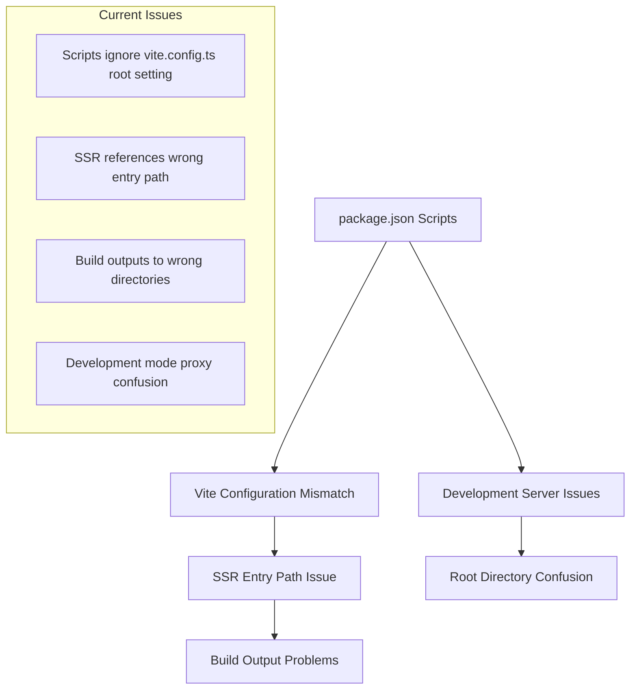
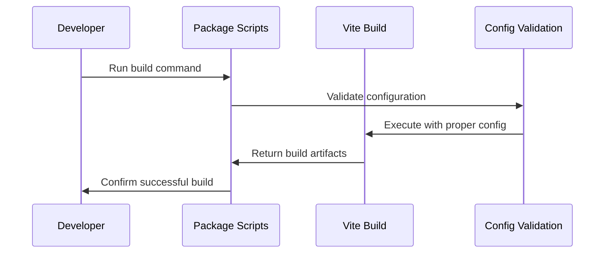

# HackerFolio-Tulio: Comprehensive Review and Fix Guide

## Overview

This design document addresses critical build configuration issues, development
setup improvements, and architectural fixes for the HackerFolio-Tulio project.
The current implementation has several misaligned configurations that prevent
optimal build processes and development workflows.

## Architecture

### Current State Analysis

The project follows a full-stack architecture with:

- **Frontend**: React 19 + Vite (SSR-enabled)
- **Backend**: Elysia.js (Bun runtime)
- **Database**: Drizzle ORM with SQLite
- **Build System**: Vite with custom configuration

### Identified Configuration Issues



## Build System Configuration Fixes

### 1. Package.json Script Alignment

**Current Issue**: Scripts execute Vite from repository root instead of
configured client root

**Problem Scripts**:

```json
{
  "dev:client": "vite",
  "build": "bun run check:all && vite build && vite build --ssr src/entry-server.tsx --outDir ../dist/server"
}
```

**Root Cause**: Vite commands don't specify config file location, causing
execution from wrong directory

**Solution**: Explicit config file specification and proper entry paths

### 2. SSR Entry Point Configuration

**Current Issue**: SSR build references `src/entry-server.tsx` relative to
repository root instead of client directory

**Impact**: Build process fragile and prone to breaking with directory
reorganization

**Required Fix**: Use proper path relative to configured Vite root

### 3. Build Output Directory Alignment

**Current Configuration Analysis**:

- Vite config sets `outDir: dist/public` for client builds
- SSR build uses `--outDir ../dist/server` which creates inconsistent structure
- Server expects SSR bundle at `../dist/server/entry-server.js`

## Development Environment Improvements

### Configuration Validation

**Current State**: Limited environment validation **Enhancement**: Comprehensive
validation pipeline



### Hot Reload Optimization

**Current Setup**:

- Server: `bun --hot server/app.ts`
- Client: `vite` (from wrong root)

**Enhancement**: Synchronized development servers with proper root handling

## Testing Configuration Integration

### Build-Test Alignment

**Current Issue**: Testing framework (Vitest) may have different configuration
than build system

**Required Integration**:

- CSS handling consistency between build and test
- Module resolution alignment
- SSR testing capabilities

## Configuration Files Structure

### Vite Configuration Enhancement

**Current Config Analysis**:

```typescript
export default defineConfig({
  root: path.resolve(__dirname, 'client'),
  // ... other config
})
```

**Enhancement**: Environment-specific configurations and explicit SSR handling

### TypeScript Path Mapping Validation

**Current Aliases**:

- `@` → `client/src`
- `@shared` → `shared`
- `@server` → `server`

**Validation**: Ensure all tools (Vite, TypeScript, ESLint) use consistent path
resolution

## Security Considerations

### Build Security

**Static Asset Handling**: Ensure proper security headers for static assets
**SSR Security**: Validate server-side rendering doesn't expose sensitive data
**Dependency Security**: Verify build process doesn't include development
dependencies in production

### Environment Configuration

**Current Validation**: Basic environment variable validation **Enhancement**:
Comprehensive validation with type safety

## Error Handling and Debugging

### Build Error Diagnostics

**Current State**: Limited error reporting during build failures
**Enhancement**: Detailed error reporting with actionable solutions

### Development Debugging

**Current Tools**: Basic logging via middleware **Enhancement**: Comprehensive
debugging workflow with proper source maps

## Performance Optimization

### Build Performance

**Current Issues**:

- Redundant Vite execution
- Inefficient SSR compilation
- Missing build caching

**Optimizations**:

- Parallel build processes where appropriate
- Efficient SSR bundle generation
- Build artifact caching

### Development Performance

**Hot Reload Efficiency**: Optimize file watching and reload triggers **Bundle
Analysis**: Implement bundle size monitoring

## Migration Strategy

### Phase 1: Critical Fixes

1. Fix package.json script paths
2. Correct SSR entry point references
3. Align build output directories

### Phase 2: Development Enhancement

1. Implement configuration validation
2. Optimize development server setup
3. Enhance error reporting

### Phase 3: Performance & Security

1. Implement build optimizations
2. Add security validations
3. Create monitoring tools

## Validation and Testing

### Configuration Testing

**Automated Validation**:

- Script execution validation
- Build output verification
- SSR functionality testing

**Manual Validation**:

- Development server startup
- Hot reload functionality
- Production build deployment

### Integration Testing

**Build Pipeline Testing**:

- Clean build execution
- SSR compilation verification
- Asset generation validation

**Development Workflow Testing**:

- Hot reload responsiveness
- Error handling during development
- Cross-platform compatibility

## Monitoring and Maintenance

### Build Monitoring

**Metrics Collection**:

- Build time tracking
- Bundle size monitoring
- Error rate tracking

**Alerting System**:

- Build failure notifications
- Performance degradation alerts
- Configuration drift detection

### Documentation Maintenance

**Configuration Documentation**: Keep configuration examples current
**Troubleshooting Guides**: Maintain troubleshooting documentation **Best
Practices**: Document recommended development practices

## Migration Strategy

### Phase 1: Critical Fixes

1. Fix package.json script paths
2. Correct SSR entry point references
3. Align build output directories

### Phase 2: Development Enhancement

1. Implement configuration validation
2. Optimize development server setup
3. Enhance error reporting

### Phase 3: Performance & Security

1. Implement build optimizations
2. Add security validations
3. Create monitoring tools

## Validation and Testing

### Configuration Testing

**Automated Validation**:

- Script execution validation
- Build output verification
- SSR functionality testing

**Manual Validation**:

- Development server startup
- Hot reload functionality
- Production build deployment

### Integration Testing

**Build Pipeline Testing**:

- Clean build execution
- SSR compilation verification
- Asset generation validation

**Development Workflow Testing**:

- Hot reload responsiveness
- Error handling during development
- Cross-platform compatibility

## Monitoring and Maintenance

### Build Monitoring

**Metrics Collection**:

- Build time tracking
- Bundle size monitoring
- Error rate tracking

**Alerting System**:

- Build failure notifications
- Performance degradation alerts
- Configuration drift detection

### Documentation Maintenance

**Configuration Documentation**: Keep configuration examples current
**Troubleshooting Guides**: Maintain troubleshooting documentation **Best
Practices**: Document recommended development practices
