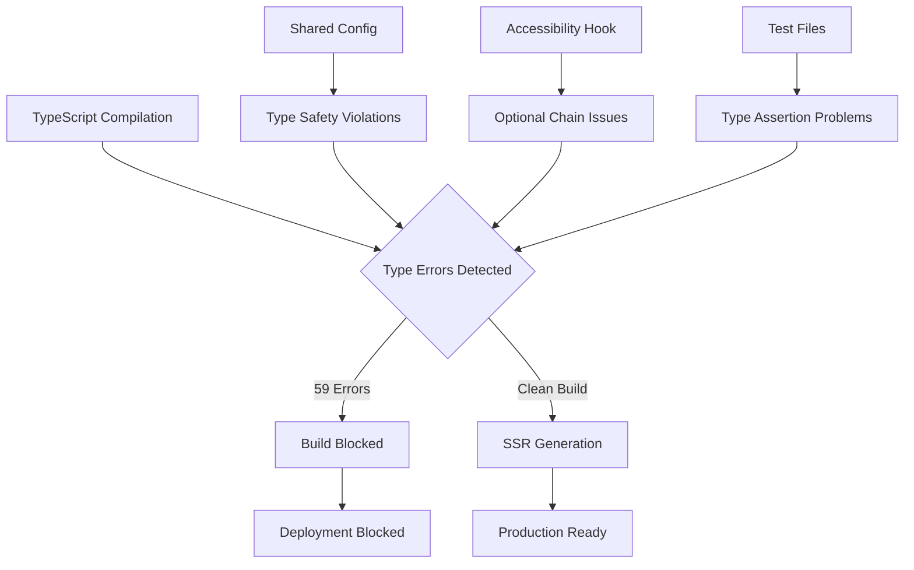
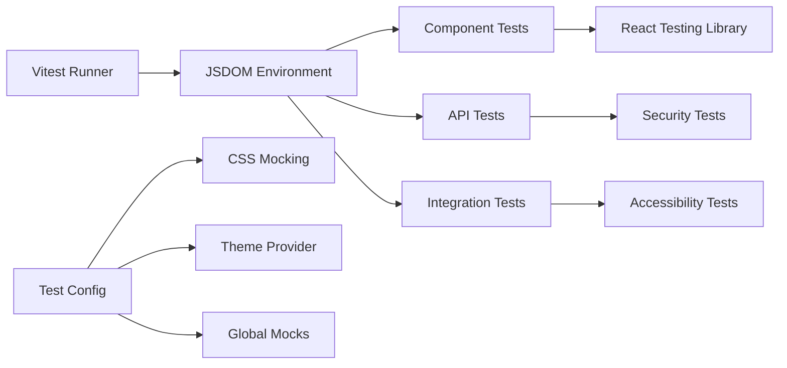
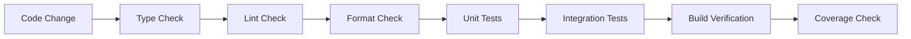

# TypeScript Error Resolution & Test Framework Stabilization

## Overview

The HackerFolio-Tulio project requires comprehensive TypeScript error resolution
and test framework stabilization to achieve deployment readiness. The current
build process is blocked by 59 TypeScript errors across 17 files, preventing
successful compilation and deployment. Additionally, test integration failures
need to be resolved to ensure code quality and reliability.

## Technology Stack Context

- **Frontend**: React 19 + Vite with SSR support
- **Backend**: Elysia.js + Bun runtime
- **Database**: Drizzle ORM + SQLite
- **Type System**: TypeScript 5.9.2 with strict type checking
- **Testing**: Vitest with jsdom environment
- **Build Tool**: Vite 7.1.3 with custom SSR configuration

## Architecture

### Current TypeScript Configuration Issues



### Error Categories

#### 1. Configuration Type Safety

- **File**: `shared/config.ts`
- **Issues**: Optional type handling, environment variable typing
- **Impact**: Core configuration system type violations

#### 2. React Hook Type Safety

- **File**: `client/src/hooks/use-accessibility.ts`
- **Issues**: Optional chaining, undefined parameter handling
- **Impact**: Accessibility features type violations

#### 3. Test Type Assertions

- **Files**: Multiple test files across client and server
- **Issues**: Unknown type casting, missing type guards
- **Impact**: Test reliability and type safety

### Testing Framework Architecture



## TypeScript Error Resolution Strategy

### Phase 1: Core Configuration Fixes

#### 1.1 Shared Configuration Type Safety

**Issue**: Optional type handling in `shared/config.ts` lines 207 and 283

```typescript
// Current problematic code
sessionSecret: this.envConfig.SESSION_SECRET || undefined,
sentry: this.envConfig.SENTRY_DSN ? {
  dsn: this.envConfig.SENTRY_DSN,
  environment: this.envConfig.NODE_ENV as string,
} : undefined,
```

**Solution**: Explicit optional type handling

```typescript
// Fixed implementation
sessionSecret: this.envConfig.SESSION_SECRET ?? undefined,
sentry: this.envConfig.SENTRY_DSN ? {
  dsn: this.envConfig.SENTRY_DSN,
  environment: this.envConfig.NODE_ENV || 'development',
} : undefined,
```

#### 1.2 Environment Type Definitions

**Enhancement**: Strengthen environment configuration typing

```typescript
interface EnvConfig {
  NODE_ENV: 'development' | 'production' | 'test'
  SESSION_SECRET?: string
  SENTRY_DSN?: string
  // Additional environment variables with explicit types
}
```

### Phase 2: React Hook Type Safety

#### 2.1 Accessibility Hook Improvements

**File**: `client/src/hooks/use-accessibility.ts`

**Issues & Solutions**:

1. **Optional Chaining Consistency**

```typescript
// Current
lastElement?.focus()
firstElement?.focus()

// Enhanced with null checks
const lastElement = focusableElements[focusableElements.length - 1]
const firstElement = focusableElements[0]
lastElement?.focus()
firstElement?.focus()
```

2. **Return Statement Consistency**

```typescript
// Enhanced effect with explicit return
useEffect(() => {
  if (trapFocus || onEscape) {
    document.addEventListener('keydown', handleKeyDown)
    return () => document.removeEventListener('keydown', handleKeyDown)
  }
  return undefined // Explicit return for consistency
}, [trapFocus, onEscape, handleKeyDown])
```

3. **Unused Parameter Handling**

```typescript
// Mark unused parameters explicitly
export function useAccessibility({
  trapFocus = false,
  autoFocus = false,
  onEscape,
  restoreFocus = true,
  ariaLabel: _ariaLabel, // Mark as unused for future implementation
}: UseAccessibilityOptions = {}) {
```

### Phase 3: Test Type Safety Resolution

#### 3.1 Type Assertion Standardization

**Pattern**: Implement type guards for unknown data

```typescript
// Before: Unsafe casting
expect(new Date((data as any).timestamp)).toBeInstanceOf(Date)

// After: Type-safe validation
const isValidData = (data: unknown): data is { timestamp: string } => {
  return typeof data === 'object' && data !== null && 'timestamp' in data
}

expect(isValidData(data) && new Date(data.timestamp)).toBeTruthy()
```

#### 3.2 API Response Type Safety

**Enhancement**: Implement runtime type validation

```typescript
// Enhanced API response handling
const validateApiResponse = <T>(data: unknown, schema: z.ZodSchema<T>): T => {
  const result = schema.safeParse(data)
  if (!result.success) {
    throw new Error(`Invalid API response: ${result.error.message}`)
  }
  return result.data
}
```

## Test Framework Stabilization

### Testing Configuration Enhancement

#### Vitest Configuration Improvements

```typescript
// Enhanced vitest.config.ts
export default defineConfig({
  test: {
    environment: 'jsdom',
    setupFiles: ['./test-config/setup-tests.ts'],
    globals: true,
    coverage: {
      provider: 'v8',
      reporter: ['text', 'html', 'lcov'],
      thresholds: {
        branches: 80,
        functions: 80,
        lines: 80,
        statements: 80,
      },
      exclude: ['node_modules/', 'dist/', 'coverage/', 'drizzle/**'],
    },
  },
  resolve: {
    alias: {
      '@': path.resolve(__dirname, 'client/src'),
      '@shared': path.resolve(__dirname, 'shared'),
      '@server': path.resolve(__dirname, 'server'),
    },
  },
})
```

### Test Environment Stabilization

#### CSS Integration Testing

**Issue**: CSS variables and Tailwind classes in test environment **Solution**:
Enhanced CSS mocking and theme provider setup

```typescript
// Enhanced test setup
import { vi, beforeEach } from 'vitest'

// Mock CSS variables
Object.defineProperty(window, 'getComputedStyle', {
  value: () => ({
    getPropertyValue: (prop: string) => {
      const cssVars: Record<string, string> = {
        '--background': '224 71% 4%',
        '--foreground': '213 31% 91%',
        '--primary': '210 40% 98%',
        // Additional CSS variables
      }
      return cssVars[prop] || ''
    },
  }),
})
```

#### Integration Test Patterns

**Security Middleware Testing**

```typescript
describe('Security Middleware Integration', () => {
  test('applies security headers correctly', async () => {
    const app = new Elysia().use(applySecurityHeaders).get('/test', () => 'OK')

    const response = await app.handle(new Request('http://localhost/test'))

    expect(response.headers.get('X-Content-Type-Options')).toBe('nosniff')
    expect(response.headers.get('X-Frame-Options')).toBe('DENY')
    expect(response.headers.get('X-XSS-Protection')).toBe('1; mode=block')
  })
})
```

## Error Resolution Implementation Plan

### Step 1: TypeScript Error Audit

1. **Run comprehensive type checking**

   ```bash
   bun run check:types 2>&1 | tee typescript-errors.log
   ```

2. **Categorize errors by severity**
   - Critical: Build blockers
   - High: Type safety violations
   - Medium: Unused imports/variables
   - Low: Style consistency

### Step 2: Systematic Resolution

1. **Core Configuration** (Highest Priority)
   - Fix `shared/config.ts` type issues
   - Enhance environment variable typing
   - Validate configuration integrity

2. **Hook Type Safety** (High Priority)
   - Resolve accessibility hook issues
   - Implement proper optional chaining
   - Add explicit return statements

3. **Test Type Safety** (Medium Priority)
   - Implement type guards for test data
   - Standardize type assertions
   - Enhance API response validation

### Step 3: Build Verification

1. **Incremental Build Testing**

   ```bash
   # After each fix category
   bun run check:types
   bun run build
   ```

2. **Test Suite Validation**
   ```bash
   bun run test:run
   bun run test:coverage
   ```

## Testing Strategy Enhancement

### Unit Test Coverage Expansion

#### Component Testing Patterns

```typescript
// Enhanced component testing with accessibility
describe('TerminalPane', () => {
  test('renders with proper ARIA attributes', async () => {
    render(<TerminalPane />, { wrapper: ThemeProvider })

    const terminal = screen.getByRole('application')
    expect(terminal).toHaveAttribute('aria-label', 'Interactive Terminal')
    expect(terminal).toHaveAttribute('aria-describedby')
  })

  test('handles keyboard navigation correctly', async () => {
    const user = userEvent.setup()
    render(<TerminalPane />, { wrapper: ThemeProvider })

    const input = screen.getByRole('textbox')
    await user.type(input, 'help{enter}')

    expect(screen.getByText(/Available commands/)).toBeInTheDocument()
  })
})
```

### Integration Test Implementation

#### API Endpoint Testing

```typescript
describe('API Integration', () => {
  test('commands endpoint returns valid response structure', async () => {
    const app = setupTestApp()
    const response = await app.handle(
      new Request('http://localhost/api/commands')
    )

    const data = await response.json()
    expect(commandSchema.safeParse(data)).toMatchObject({
      success: true,
    })
  })
})
```

### Security Test Enhancement

#### Security Headers Validation

```typescript
describe('Security Implementation', () => {
  test('all security headers are applied in production', async () => {
    process.env.NODE_ENV = 'production'

    const app = setupProductionApp()
    const response = await app.handle(new Request('http://localhost/'))

    const securityHeaders = [
      'X-Content-Type-Options',
      'X-Frame-Options',
      'X-XSS-Protection',
      'Strict-Transport-Security',
    ]

    securityHeaders.forEach(header => {
      expect(response.headers.get(header)).toBeTruthy()
    })
  })
})
```

## Quality Assurance Measures

### Automated Validation Pipeline



### Pre-deployment Checklist

1. **TypeScript Compilation**
   - [ ] Zero TypeScript errors
   - [ ] Strict mode compliance
   - [ ] Import resolution verified

2. **Test Suite Integrity**
   - [ ] All unit tests passing
   - [ ] Integration tests stable
   - [ ] Security tests validated
   - [ ] Coverage thresholds met (80%+)

3. **Build Process Validation**
   - [ ] Client build successful
   - [ ] Server SSR build functional
   - [ ] Asset optimization verified

4. **Runtime Verification**
   - [ ] Development server stable
   - [ ] Production mode functional
   - [ ] Database migrations working

## Success Metrics

### Build Success Indicators

- TypeScript compilation: 0 errors
- Build process completion: dist/client and dist/server generated
- Test suite: 100% passing rate
- Coverage: >80% across all metrics

### Performance Impact Assessment

- Build time improvement: Target <30s total build time
- Type checking speed: Target <10s type checking
- Test execution: Target <60s full test suite

### Code Quality Metrics

- Maintainability: Reduced type assertions, improved type safety
- Reliability: Enhanced error handling, comprehensive test coverage
- Security: Validated middleware integration, header application

### Error Categories

#### 1. Configuration Type Safety

- **File**: `shared/config.ts`
- **Issues**: Optional type handling, environment variable typing
- **Impact**: Core configuration system type violations

#### 2. React Hook Type Safety

- **File**: `client/src/hooks/use-accessibility.ts`
- **Issues**: Optional chaining, undefined parameter handling
- **Impact**: Accessibility features type violations

#### 3. Test Type Assertions

- **Files**: Multiple test files across client and server
- **Issues**: Unknown type casting, missing type guards
- **Impact**: Test reliability and type safety

### Testing Framework Architecture


## TypeScript Error Resolution Strategy

### Phase 1: Core Configuration Fixes

#### 1.1 Shared Configuration Type Safety

**Issue**: Optional type handling in `shared/config.ts` lines 207 and 283

```typescript
// Current problematic code
sessionSecret: this.envConfig.SESSION_SECRET || undefined,
sentry: this.envConfig.SENTRY_DSN ? {
  dsn: this.envConfig.SENTRY_DSN,
  environment: this.envConfig.NODE_ENV as string,
} : undefined,
```

**Solution**: Explicit optional type handling

```typescript
// Fixed implementation
sessionSecret: this.envConfig.SESSION_SECRET ?? undefined,
sentry: this.envConfig.SENTRY_DSN ? {
  dsn: this.envConfig.SENTRY_DSN,
  environment: this.envConfig.NODE_ENV || 'development',
} : undefined,
```

#### 1.2 Environment Type Definitions

**Enhancement**: Strengthen environment configuration typing

```typescript
interface EnvConfig {
  NODE_ENV: 'development' | 'production' | 'test'
  SESSION_SECRET?: string
  SENTRY_DSN?: string
  // Additional environment variables with explicit types
}
```

### Phase 2: React Hook Type Safety

#### 2.1 Accessibility Hook Improvements

**File**: `client/src/hooks/use-accessibility.ts`

**Issues & Solutions**:

1. **Optional Chaining Consistency**

```typescript
// Current
lastElement?.focus()
firstElement?.focus()

// Enhanced with null checks
const lastElement = focusableElements[focusableElements.length - 1]
const firstElement = focusableElements[0]
lastElement?.focus()
firstElement?.focus()
```

2. **Return Statement Consistency**

```typescript
// Enhanced effect with explicit return
useEffect(() => {
  if (trapFocus || onEscape) {
    document.addEventListener('keydown', handleKeyDown)
    return () => document.removeEventListener('keydown', handleKeyDown)
  }
  return undefined // Explicit return for consistency
}, [trapFocus, onEscape, handleKeyDown])
```

3. **Unused Parameter Handling**

```typescript
// Mark unused parameters explicitly
export function useAccessibility({
  trapFocus = false,
  autoFocus = false,
  onEscape,
  restoreFocus = true,
  ariaLabel: _ariaLabel, // Mark as unused for future implementation
}: UseAccessibilityOptions = {}) {
```

### Phase 3: Test Type Safety Resolution

#### 3.1 Type Assertion Standardization

**Pattern**: Implement type guards for unknown data

```typescript
// Before: Unsafe casting
expect(new Date((data as any).timestamp)).toBeInstanceOf(Date)

// After: Type-safe validation
const isValidData = (data: unknown): data is { timestamp: string } => {
  return typeof data === 'object' && data !== null && 'timestamp' in data
}

expect(isValidData(data) && new Date(data.timestamp)).toBeTruthy()
```

#### 3.2 API Response Type Safety

**Enhancement**: Implement runtime type validation

```typescript
// Enhanced API response handling
const validateApiResponse = <T>(data: unknown, schema: z.ZodSchema<T>): T => {
  const result = schema.safeParse(data)
  if (!result.success) {
    throw new Error(`Invalid API response: ${result.error.message}`)
  }
  return result.data
}
```

## Test Framework Stabilization

### Testing Configuration Enhancement

#### Vitest Configuration Improvements

```typescript
// Enhanced vitest.config.ts
export default defineConfig({
  test: {
    environment: 'jsdom',
    setupFiles: ['./test-config/setup-tests.ts'],
    globals: true,
    coverage: {
      provider: 'v8',
      reporter: ['text', 'html', 'lcov'],
      thresholds: {
        branches: 80,
        functions: 80,
        lines: 80,
        statements: 80,
      },
      exclude: ['node_modules/', 'dist/', 'coverage/', 'drizzle/**'],
    },
  },
  resolve: {
    alias: {
      '@': path.resolve(__dirname, 'client/src'),
      '@shared': path.resolve(__dirname, 'shared'),
      '@server': path.resolve(__dirname, 'server'),
    },
  },
})
```

### Test Environment Stabilization

#### CSS Integration Testing

**Issue**: CSS variables and Tailwind classes in test environment **Solution**:
Enhanced CSS mocking and theme provider setup

```typescript
// Enhanced test setup
import { vi, beforeEach } from 'vitest'

// Mock CSS variables
Object.defineProperty(window, 'getComputedStyle', {
  value: () => ({
    getPropertyValue: (prop: string) => {
      const cssVars: Record<string, string> = {
        '--background': '224 71% 4%',
        '--foreground': '213 31% 91%',
        '--primary': '210 40% 98%',
        // Additional CSS variables
      }
      return cssVars[prop] || ''
    },
  }),
})
```

#### Integration Test Patterns

**Security Middleware Testing**

```typescript
describe('Security Middleware Integration', () => {
  test('applies security headers correctly', async () => {
    const app = new Elysia().use(applySecurityHeaders).get('/test', () => 'OK')

    const response = await app.handle(new Request('http://localhost/test'))

    expect(response.headers.get('X-Content-Type-Options')).toBe('nosniff')
    expect(response.headers.get('X-Frame-Options')).toBe('DENY')
    expect(response.headers.get('X-XSS-Protection')).toBe('1; mode=block')
  })
})
```

## Error Resolution Implementation Plan

### Step 1: TypeScript Error Audit

1. **Run comprehensive type checking**

   ```bash
   bun run check:types 2>&1 | tee typescript-errors.log
   ```

2. **Categorize errors by severity**
   - Critical: Build blockers
   - High: Type safety violations
   - Medium: Unused imports/variables
   - Low: Style consistency

### Step 2: Systematic Resolution

1. **Core Configuration** (Highest Priority)
   - Fix `shared/config.ts` type issues
   - Enhance environment variable typing
   - Validate configuration integrity

2. **Hook Type Safety** (High Priority)
   - Resolve accessibility hook issues
   - Implement proper optional chaining
   - Add explicit return statements

3. **Test Type Safety** (Medium Priority)
   - Implement type guards for test data
   - Standardize type assertions
   - Enhance API response validation

### Step 3: Build Verification

1. **Incremental Build Testing**

   ```bash
   # After each fix category
   bun run check:types
   bun run build
   ```

2. **Test Suite Validation**
   ```bash
   bun run test:run
   bun run test:coverage
   ```

## Testing Strategy Enhancement

### Unit Test Coverage Expansion

#### Component Testing Patterns

```typescript
// Enhanced component testing with accessibility
describe('TerminalPane', () => {
  test('renders with proper ARIA attributes', async () => {
    render(<TerminalPane />, { wrapper: ThemeProvider })

    const terminal = screen.getByRole('application')
    expect(terminal).toHaveAttribute('aria-label', 'Interactive Terminal')
    expect(terminal).toHaveAttribute('aria-describedby')
  })

  test('handles keyboard navigation correctly', async () => {
    const user = userEvent.setup()
    render(<TerminalPane />, { wrapper: ThemeProvider })

    const input = screen.getByRole('textbox')
    await user.type(input, 'help{enter}')

    expect(screen.getByText(/Available commands/)).toBeInTheDocument()
  })
})
```

### Integration Test Implementation

#### API Endpoint Testing

```typescript
describe('API Integration', () => {
  test('commands endpoint returns valid response structure', async () => {
    const app = setupTestApp()
    const response = await app.handle(
      new Request('http://localhost/api/commands')
    )

    const data = await response.json()
    expect(commandSchema.safeParse(data)).toMatchObject({
      success: true,
    })
  })
})
```

### Security Test Enhancement

#### Security Headers Validation

```typescript
describe('Security Implementation', () => {
  test('all security headers are applied in production', async () => {
    process.env.NODE_ENV = 'production'

    const app = setupProductionApp()
    const response = await app.handle(new Request('http://localhost/'))

    const securityHeaders = [
      'X-Content-Type-Options',
      'X-Frame-Options',
      'X-XSS-Protection',
      'Strict-Transport-Security',
    ]

    securityHeaders.forEach(header => {
      expect(response.headers.get(header)).toBeTruthy()
    })
  })
})
```

## Quality Assurance Measures

### Automated Validation Pipeline


### Pre-deployment Checklist

1. **TypeScript Compilation**
   - [ ] Zero TypeScript errors
   - [ ] Strict mode compliance
   - [ ] Import resolution verified

2. **Test Suite Integrity**
   - [ ] All unit tests passing
   - [ ] Integration tests stable
   - [ ] Security tests validated
   - [ ] Coverage thresholds met (80%+)

3. **Build Process Validation**
   - [ ] Client build successful
   - [ ] Server SSR build functional
   - [ ] Asset optimization verified

4. **Runtime Verification**
   - [ ] Development server stable
   - [ ] Production mode functional
   - [ ] Database migrations working

## Success Metrics

### Build Success Indicators

- TypeScript compilation: 0 errors
- Build process completion: dist/client and dist/server generated
- Test suite: 100% passing rate
- Coverage: >80% across all metrics

### Performance Impact Assessment

- Build time improvement: Target <30s total build time
- Type checking speed: Target <10s type checking
- Test execution: Target <60s full test suite

### Code Quality Metrics

- Maintainability: Reduced type assertions, improved type safety
- Reliability: Enhanced error handling, comprehensive test coverage
- Security: Validated middleware integration, header application
