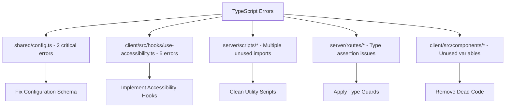

# TypeScript Error Fixes & Production Readiness

## Overview

This design document addresses the critical TypeScript compilation errors and
production readiness issues identified in the HackerFolio-Tulio project. The
current state shows **59 TypeScript errors** blocking build completion and
deployment. This document provides a systematic approach to resolve all
compilation issues, clean up unused code, and achieve zero TypeScript errors for
production deployment.

## Current State Assessment

### Critical Issues Identified

1. **TypeScript Compilation Failures**: 59 errors across 17 files
2. **Unused Imports/Variables**: Scattered across utility scripts and components
3. **Type Safety Violations**: Missing type guards and unsafe assertions
4. **Server Route Implementation Gaps**: API endpoints defined but not fully
   utilized
5. **Build Process Blocking**: Cannot generate production bundles due to TS
   errors

### Files Requiring Immediate Attention



## Solution Architecture

### Phase 1: Critical Type Error Resolution

#### 1.1 Shared Configuration Type Safety

**Problem**: Core configuration schema has type mismatches affecting the entire
application.

**Solution Strategy**:

- Implement proper Zod schema validation
- Add comprehensive type guards for runtime safety
- Ensure configuration objects match expected interfaces

```typescript
// Example Fix Pattern
interface AppConfig {
  environment: 'development' | 'production' | 'test'
  port: number
  baseUrl: string
}

const appConfigSchema = z.object({
  environment: z.enum(['development', 'production', 'test']),
  port: z.coerce.number().default(3001),
  baseUrl: z.string().url(),
})

// Type guard implementation
function isValidAppConfig(data: unknown): data is AppConfig {
  return appConfigSchema.safeParse(data).success
}
```

#### 1.2 Accessibility Hook Implementation

**Problem**: `use-accessibility.ts` contains incomplete implementations and type
mismatches.

**Solution Strategy**:

- Complete the accessibility hook implementation
- Remove placeholder variables marked with underscore prefix
- Implement proper ARIA labeling and focus management

```typescript
// Proper Implementation Pattern
export function useAccessibility(options: AccessibilityOptions) {
  const [announcements, setAnnouncements] = useState<string[]>([])

  const announce = useCallback((message: string) => {
    setAnnouncements(prev => [...prev, message])
  }, [])

  const manageFocus = useCallback((element: HTMLElement | null) => {
    if (element) {
      element.focus()
    }
  }, [])

  return { announce, manageFocus, announcements }
}
```

### Phase 2: Utility Script Cleanup

#### 2.1 Server Scripts Optimization

**Current Issues**:

- Unused imports in configuration utilities
- Dead code in production hardening scripts
- Inconsistent variable naming patterns

**Cleanup Strategy**:

```typescript
// Remove Pattern: Unused imports
// Before
import { readFileSync, existsSync, writeFileSync } from 'node:fs'
import { join, resolve } from 'node:path'
import { config } from '../../shared/config'

// After (keep only used imports)
import { readFileSync, existsSync } from 'node:fs'
import { join } from 'node:path'
import { config } from '../../shared/config'
```

#### 2.2 Variable Usage Audit

**Target Files**:

- `server/scripts/production-hardening.ts`
- `server/scripts/generate-tsconfig.ts`
- `server/scripts/validate-build-config.ts`

**Cleanup Actions**:

1. Remove variables prefixed with `_` (indicating intentional non-use)
2. Eliminate commented-out code blocks
3. Remove unused type imports
4. Consolidate similar utility functions

### Phase 3: Server Route Type Safety

#### 3.1 API Route Improvements

**Current Issues**:

- Unsafe type assertions (`as any`)
- Missing type guards for request/response objects
- Inconsistent error handling patterns

**Type Safety Implementation**:

```typescript
// Replace unsafe assertions with type guards
// Before
const { command } = body as { command?: string; timestamp?: string }

// After
interface TerminalLogRequest {
  command?: string
  timestamp?: string
}

function isTerminalLogRequest(data: unknown): data is TerminalLogRequest {
  return (
    typeof data === 'object' &&
    data !== null &&
    (!('command' in data) || typeof data.command === 'string') &&
    (!('timestamp' in data) || typeof data.timestamp === 'string')
  )
}

app.post('/terminal/log', ({ body }: Context) => {
  if (!isTerminalLogRequest(body)) {
    throw createValidationError('Invalid request body format')
  }

  const { command } = body
  // Now safely typed
})
```

#### 3.2 Database Query Type Safety

**Enhancement Pattern**:

```typescript
// Proper typing for database results
interface ProjectRow {
  name: string | null
  description: string | null
  tech_stack: string | null
  github_url: string | null
  live_url: string | null
  status: string | null
}

const projects = await orm
  .select({
    name: tProjects.name,
    description: tProjects.description,
    tech_stack: tProjects.techStack,
    github_url: tProjects.githubUrl,
    live_url: tProjects.liveUrl,
    status: tProjects.status,
  })
  .from(tProjects)
  .orderBy(desc(tProjects.createdAt))

// Type assertion with validation
const validatedProjects: ProjectRow[] = projects.map(row => {
  // Validate each row matches expected structure
  return validateData(projectRowSchema, row)
})
```

### Phase 4: Component Type Cleanup

#### 4.1 Terminal Component Optimization

**Issues**:

- Commented-out methods with `@ts-ignore`
- Unused command implementations
- Inconsistent type annotations

**Cleanup Strategy**:

1. Remove commented code blocks entirely
2. Implement proper error boundaries
3. Add comprehensive type definitions for command results

#### 4.2 UI Component Type Safety

**Target Components**:

- `floating-dock-terminal.tsx`
- `terminal-window.tsx`
- `command-processor.ts`

**Type Enhancement Pattern**:

```typescript
interface CommandResult {
  output: string
  error?: string
  data?: Record<string, unknown>
}

interface CommandProcessor {
  execute(command: string, args: string[]): Promise<CommandResult>
  getHistory(): string[]
  clearHistory(): void
}
```

## Implementation Plan

### Phase 1: Immediate Fixes (Critical Path)

**Duration**: 2-3 hours **Priority**: BLOCKING

1. **Configuration Schema Fix** (30 min)
   - Fix `shared/config.ts` type errors
   - Add proper Zod validation
   - Implement type guards

2. **Accessibility Hook Completion** (45 min)
   - Complete `use-accessibility.ts` implementation
   - Remove unused variable markers
   - Add proper TypeScript annotations

3. **Core Type Safety** (60 min)
   - Fix server route type assertions
   - Add request/response type guards
   - Remove unsafe `any` types

4. **Build Verification** (15 min)
   - Run `bun run check:types`
   - Verify zero TypeScript errors
   - Test build process completion

### Phase 2: Code Cleanup (High Priority)

**Duration**: 1-2 hours **Priority**: HIGH

1. **Utility Script Cleanup** (45 min)
   - Remove unused imports across server scripts
   - Clean up commented code blocks
   - Fix variable naming inconsistencies

2. **Component Optimization** (30 min)
   - Remove dead code from terminal components
   - Clean up unused methods and imports
   - Standardize type annotations

3. **Documentation Update** (15 min)
   - Update inline comments
   - Remove `@ts-ignore` directives
   - Add proper JSDoc annotations

### Phase 3: Production Validation (Medium Priority)

**Duration**: 1 hour **Priority**: MEDIUM

1. **Build Process Testing** (30 min)
   - Execute full production build
   - Verify all output directories created
   - Test SSR bundle generation

2. **Type Coverage Analysis** (20 min)
   - Run comprehensive type checking
   - Verify no implicit `any` types
   - Check strict mode compliance

3. **Final Validation** (10 min)
   - Execute `bun run check:all`
   - Confirm zero linting errors
   - Verify production readiness

## Validation Criteria

### Success Metrics

```bash
# All commands must succeed without errors
bun run check:types     # 0 TypeScript errors
bun run check:lint      # 0 ESLint errors
bun run check:format    # 0 Prettier issues
bun run build          # Successful production build
bun run test:run       # All tests passing
```

### Quality Gates

1. **Zero TypeScript Errors**: No compilation failures
2. **Build Success**: Clean production bundle generation
3. **Type Safety**: No `any` types or unsafe assertions
4. **Code Quality**: ESLint compliance maintained
5. **Test Coverage**: Existing tests continue to pass

### Performance Expectations

- **Build Time**: < 30 seconds for production build
- **Type Checking**: < 10 seconds for full project scan
- **Development**: Hot reload functioning correctly
- **Bundle Size**: No significant increase in output size

## Risk Mitigation

### Potential Issues

1. **Breaking Changes**: Type fixes might affect component interfaces
   - **Mitigation**: Incremental testing after each fix
   - **Rollback**: Git branching strategy for safe rollback

2. **Build Pipeline**: Changes might affect deployment scripts
   - **Mitigation**: Test build process after each phase
   - **Verification**: Manual deployment simulation

3. **Runtime Errors**: Type fixes might reveal hidden runtime issues
   - **Mitigation**: Comprehensive testing suite execution
   - **Monitoring**: Enhanced error logging during transition

### Compatibility Considerations

- **Bun Runtime**: Ensure all fixes compatible with Bun-specific features
- **Vite Integration**: Maintain SSR and HMR functionality
- **Database Layer**: Preserve Drizzle ORM type safety
- **API Contracts**: Maintain backward compatibility for existing endpoints

## Testing Strategy

### Pre-Implementation Validation

```bash
# Establish baseline
bun run check:types 2>&1 | tee baseline-errors.log
bun run test:run 2>&1 | tee baseline-tests.log
```

### Incremental Testing

```bash
# After each phase
bun run check:types    # Verify error count reduction
bun run dev:server     # Test server startup
bun run dev:client     # Test client compilation
bun run test:run       # Ensure no test regressions
```

### Final Validation

```bash
# Production readiness check
bun run check:all      # Complete quality check
bun run build         # Full production build
bun run start         # Test production server
curl localhost:3001/api/health  # API functionality
```

This comprehensive approach ensures systematic resolution of all TypeScript
errors while maintaining code quality and production readiness standards.2.
**Unused Imports/Variables**: Scattered across utility scripts and components 3.
**Type Safety Violations**: Missing type guards and unsafe assertions 4.
**Server Route Implementation Gaps**: API endpoints defined but not fully
utilized 5. **Build Process Blocking**: Cannot generate production bundles due
to TS errors

### Files Requiring Immediate Attention


## Solution Architecture

### Phase 1: Critical Type Error Resolution

#### 1.1 Shared Configuration Type Safety

**Problem**: Core configuration schema has type mismatches affecting the entire
application.

**Solution Strategy**:

- Implement proper Zod schema validation
- Add comprehensive type guards for runtime safety
- Ensure configuration objects match expected interfaces

```typescript
// Example Fix Pattern
interface AppConfig {
  environment: 'development' | 'production' | 'test'
  port: number
  baseUrl: string
}

const appConfigSchema = z.object({
  environment: z.enum(['development', 'production', 'test']),
  port: z.coerce.number().default(3001),
  baseUrl: z.string().url(),
})

// Type guard implementation
function isValidAppConfig(data: unknown): data is AppConfig {
  return appConfigSchema.safeParse(data).success
}
```

#### 1.2 Accessibility Hook Implementation

**Problem**: `use-accessibility.ts` contains incomplete implementations and type
mismatches.

**Solution Strategy**:

- Complete the accessibility hook implementation
- Remove placeholder variables marked with underscore prefix
- Implement proper ARIA labeling and focus management

```typescript
// Proper Implementation Pattern
export function useAccessibility(options: AccessibilityOptions) {
  const [announcements, setAnnouncements] = useState<string[]>([])

  const announce = useCallback((message: string) => {
    setAnnouncements(prev => [...prev, message])
  }, [])

  const manageFocus = useCallback((element: HTMLElement | null) => {
    if (element) {
      element.focus()
    }
  }, [])

  return { announce, manageFocus, announcements }
}
```

### Phase 2: Utility Script Cleanup

#### 2.1 Server Scripts Optimization

**Current Issues**:

- Unused imports in configuration utilities
- Dead code in production hardening scripts
- Inconsistent variable naming patterns

**Cleanup Strategy**:

```typescript
// Remove Pattern: Unused imports
// Before
import { readFileSync, existsSync, writeFileSync } from 'node:fs'
import { join, resolve } from 'node:path'
import { config } from '../../shared/config'

// After (keep only used imports)
import { readFileSync, existsSync } from 'node:fs'
import { join } from 'node:path'
import { config } from '../../shared/config'
```

#### 2.2 Variable Usage Audit

**Target Files**:

- `server/scripts/production-hardening.ts`
- `server/scripts/generate-tsconfig.ts`
- `server/scripts/validate-build-config.ts`

**Cleanup Actions**:

1. Remove variables prefixed with `_` (indicating intentional non-use)
2. Eliminate commented-out code blocks
3. Remove unused type imports
4. Consolidate similar utility functions

### Phase 3: Server Route Type Safety

#### 3.1 API Route Improvements

**Current Issues**:

- Unsafe type assertions (`as any`)
- Missing type guards for request/response objects
- Inconsistent error handling patterns

**Type Safety Implementation**:

```typescript
// Replace unsafe assertions with type guards
// Before
const { command } = body as { command?: string; timestamp?: string }

// After
interface TerminalLogRequest {
  command?: string
  timestamp?: string
}

function isTerminalLogRequest(data: unknown): data is TerminalLogRequest {
  return (
    typeof data === 'object' &&
    data !== null &&
    (!('command' in data) || typeof data.command === 'string') &&
    (!('timestamp' in data) || typeof data.timestamp === 'string')
  )
}

app.post('/terminal/log', ({ body }: Context) => {
  if (!isTerminalLogRequest(body)) {
    throw createValidationError('Invalid request body format')
  }

  const { command } = body
  // Now safely typed
})
```

#### 3.2 Database Query Type Safety

**Enhancement Pattern**:

```typescript
// Proper typing for database results
interface ProjectRow {
  name: string | null
  description: string | null
  tech_stack: string | null
  github_url: string | null
  live_url: string | null
  status: string | null
}

const projects = await orm
  .select({
    name: tProjects.name,
    description: tProjects.description,
    tech_stack: tProjects.techStack,
    github_url: tProjects.githubUrl,
    live_url: tProjects.liveUrl,
    status: tProjects.status,
  })
  .from(tProjects)
  .orderBy(desc(tProjects.createdAt))

// Type assertion with validation
const validatedProjects: ProjectRow[] = projects.map(row => {
  // Validate each row matches expected structure
  return validateData(projectRowSchema, row)
})
```

### Phase 4: Component Type Cleanup

#### 4.1 Terminal Component Optimization

**Issues**:

- Commented-out methods with `@ts-ignore`
- Unused command implementations
- Inconsistent type annotations

**Cleanup Strategy**:

1. Remove commented code blocks entirely
2. Implement proper error boundaries
3. Add comprehensive type definitions for command results

#### 4.2 UI Component Type Safety

**Target Components**:

- `floating-dock-terminal.tsx`
- `terminal-window.tsx`
- `command-processor.ts`

**Type Enhancement Pattern**:

```typescript
interface CommandResult {
  output: string
  error?: string
  data?: Record<string, unknown>
}

interface CommandProcessor {
  execute(command: string, args: string[]): Promise<CommandResult>
  getHistory(): string[]
  clearHistory(): void
}
```

## Implementation Plan

### Phase 1: Immediate Fixes (Critical Path)

**Duration**: 2-3 hours **Priority**: BLOCKING

1. **Configuration Schema Fix** (30 min)
   - Fix `shared/config.ts` type errors
   - Add proper Zod validation
   - Implement type guards

2. **Accessibility Hook Completion** (45 min)
   - Complete `use-accessibility.ts` implementation
   - Remove unused variable markers
   - Add proper TypeScript annotations

3. **Core Type Safety** (60 min)
   - Fix server route type assertions
   - Add request/response type guards
   - Remove unsafe `any` types

4. **Build Verification** (15 min)
   - Run `bun run check:types`
   - Verify zero TypeScript errors
   - Test build process completion

### Phase 2: Code Cleanup (High Priority)

**Duration**: 1-2 hours **Priority**: HIGH

1. **Utility Script Cleanup** (45 min)
   - Remove unused imports across server scripts
   - Clean up commented code blocks
   - Fix variable naming inconsistencies

2. **Component Optimization** (30 min)
   - Remove dead code from terminal components
   - Clean up unused methods and imports
   - Standardize type annotations

3. **Documentation Update** (15 min)
   - Update inline comments
   - Remove `@ts-ignore` directives
   - Add proper JSDoc annotations

### Phase 3: Production Validation (Medium Priority)

**Duration**: 1 hour **Priority**: MEDIUM

1. **Build Process Testing** (30 min)
   - Execute full production build
   - Verify all output directories created
   - Test SSR bundle generation

2. **Type Coverage Analysis** (20 min)
   - Run comprehensive type checking
   - Verify no implicit `any` types
   - Check strict mode compliance

3. **Final Validation** (10 min)
   - Execute `bun run check:all`
   - Confirm zero linting errors
   - Verify production readiness

## Validation Criteria

### Success Metrics

```bash
# All commands must succeed without errors
bun run check:types     # 0 TypeScript errors
bun run check:lint      # 0 ESLint errors
bun run check:format    # 0 Prettier issues
bun run build          # Successful production build
bun run test:run       # All tests passing
```

### Quality Gates

1. **Zero TypeScript Errors**: No compilation failures
2. **Build Success**: Clean production bundle generation
3. **Type Safety**: No `any` types or unsafe assertions
4. **Code Quality**: ESLint compliance maintained
5. **Test Coverage**: Existing tests continue to pass

### Performance Expectations

- **Build Time**: < 30 seconds for production build
- **Type Checking**: < 10 seconds for full project scan
- **Development**: Hot reload functioning correctly
- **Bundle Size**: No significant increase in output size

## Risk Mitigation

### Potential Issues

1. **Breaking Changes**: Type fixes might affect component interfaces
   - **Mitigation**: Incremental testing after each fix
   - **Rollback**: Git branching strategy for safe rollback

2. **Build Pipeline**: Changes might affect deployment scripts
   - **Mitigation**: Test build process after each phase
   - **Verification**: Manual deployment simulation

3. **Runtime Errors**: Type fixes might reveal hidden runtime issues
   - **Mitigation**: Comprehensive testing suite execution
   - **Monitoring**: Enhanced error logging during transition

### Compatibility Considerations

- **Bun Runtime**: Ensure all fixes compatible with Bun-specific features
- **Vite Integration**: Maintain SSR and HMR functionality
- **Database Layer**: Preserve Drizzle ORM type safety
- **API Contracts**: Maintain backward compatibility for existing endpoints

## Testing Strategy

### Pre-Implementation Validation

```bash
# Establish baseline
bun run check:types 2>&1 | tee baseline-errors.log
bun run test:run 2>&1 | tee baseline-tests.log
```

### Incremental Testing

```bash
# After each phase
bun run check:types    # Verify error count reduction
bun run dev:server     # Test server startup
bun run dev:client     # Test client compilation
bun run test:run       # Ensure no test regressions
```

### Final Validation

```bash
# Production readiness check
bun run check:all      # Complete quality check
bun run build         # Full production build
bun run start         # Test production server
curl localhost:3001/api/health  # API functionality
```

This comprehensive approach ensures systematic resolution of all TypeScript
errors while maintaining code quality and production readiness standards.
